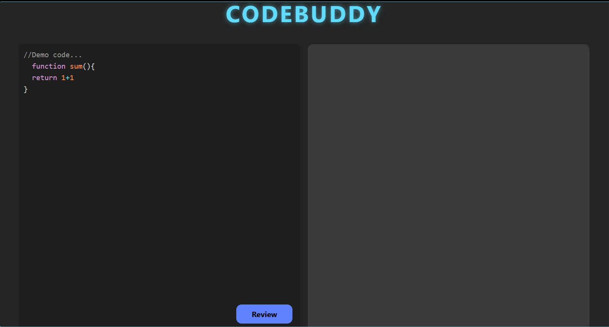
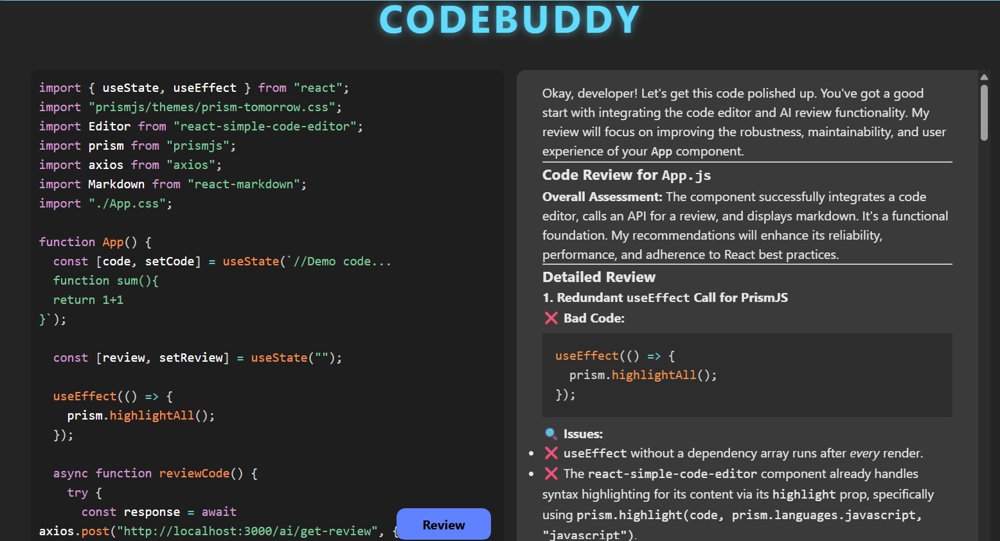
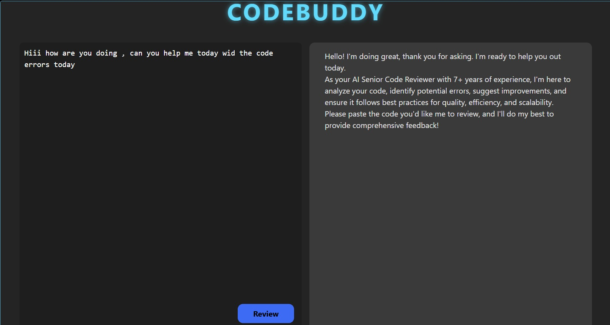

# 🤖 CodeBuddy – AI Code Reviewer

An AI-powered code review application built using the **MERN Stack** and **Google Gemini API**. CodeBuddy analyzes code snippets and provides intelligent suggestions, helping developers improve code quality, readability, and efficiency.

---

## 📖 About the Project

CodeBuddy is an AI-powered web application that allows users to submit code snippets and receive detailed feedback generated by Google's Gemini API. The project demonstrates full-stack development by integrating a React frontend, Node.js/Express backend, MongoDB database, and AI capabilities.

---

## ✨ Features

- 🤖 AI-powered code review
- 💡 Intelligent code improvement suggestions
- ⚡ Fast and responsive user interface
- 📝 Submit and analyze code snippets
- 🔍 Supports multiple programming languages
- 🌐 Full-stack MERN architecture

---

## 🛠 Tech Stack

### Frontend
- React.js
- HTML5
- CSS3
- JavaScript

### Backend
- Node.js
- Express.js

### Database
- MongoDB

### AI Integration
- Google Gemini API

---

## 📸 Screenshots










---

## 🚀 Getting Started

### Clone the repository

```bash
git clone https://github.com/khushi1-debug/YOUR_REPOSITORY_NAME.git
```

### Install dependencies

Frontend

```bash
cd client
npm install
npm start
```

Backend

```bash
cd server
npm install
npm start
```

---

## 👩‍💻 Author

**Khushi Yadav**

GitHub: https://github.com/khushi1-debug

